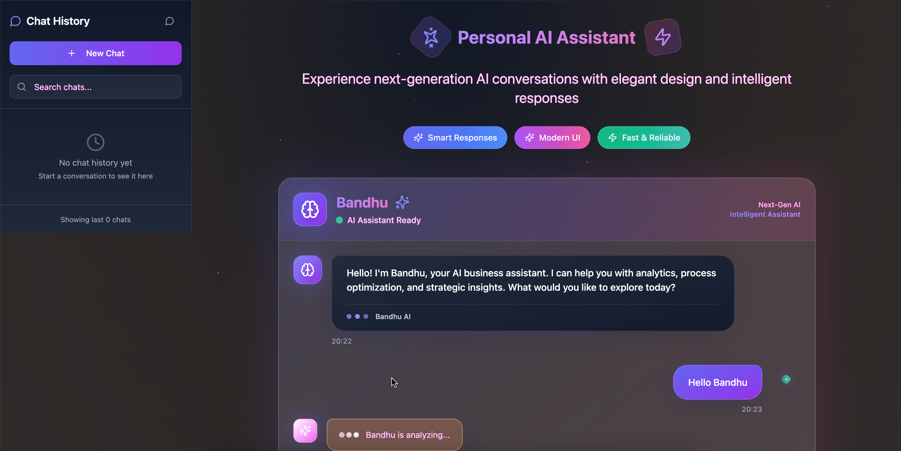

# Welcome to your Personal AI Assistant - Bandhu

## Project Overview

This project is designed to provide a seamless interface for managing chat interactions efficiently. It leverages modern web technologies to deliver a responsive and intuitive user experience.

## Technologies Used

This project is built with:
- **Vite**: A modern frontend build tool that provides faster and leaner development.
- **TypeScript**: For adding types to JavaScript, ensuring more robust code.
- **React**: A JavaScript library for building user interfaces.
- **shadcn-ui**: A UI framework that offers a variety of ready-to-use components.
- **Tailwind CSS**: A utility-first CSS framework for rapidly building custom designs.

## How It Works

The application allows users to interact through a chat interface, managing sessions and messages dynamically. It integrates various components for handling different aspects of the chat experience, ensuring a smooth and efficient communication flow.

## Visuals



## How to Get Started

Here's how you can set up and start contributing to the project:

```sh
# Clone the repository using the project's Git URL.
git clone https://github.com/praveenkrjha93/ai-assistant-chatbot.git

# Navigate to the project directory.
cd ai-assistant-chatbot

# Install the necessary dependencies.
npm i

# Start the development server with auto-reloading and an instant preview.
npm run dev
```

## Deployment

To deploy this project, simply open [bandhu](https://bandhu.dev/projects/226bb91f-d59d-4498-a8aa-afad74d8109e) and click on Share -> Publish.

## Custom Domain Connection

To connect a custom domain to your bandhu project, navigate to Project > Settings > Domains and click Connect Domain. For a detailed guide, visit [Setting up a custom domain](https://docs.bandhu.dev/tips-tricks/custom-domain#step-by-step-guide).
